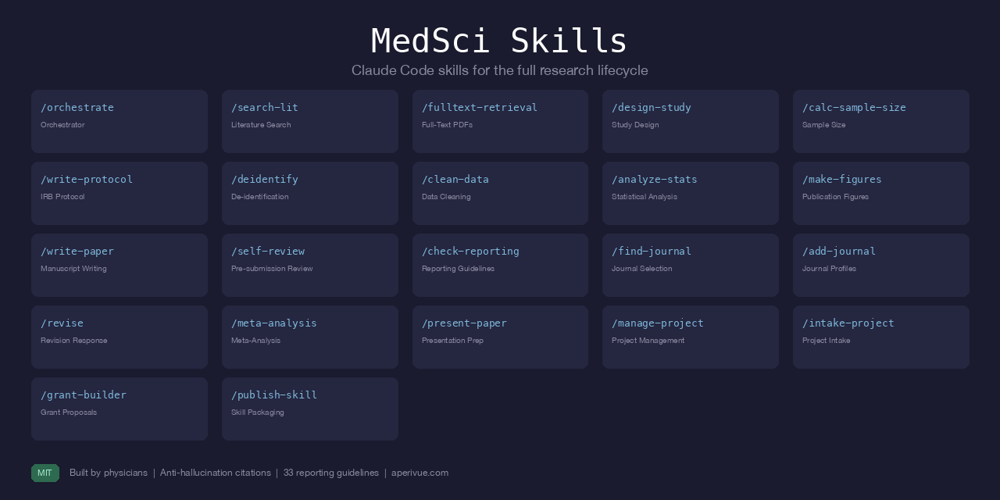

<div align="center">

# MedSci Skills

**22 skills that actually work.** Built by a physician-researcher, tested on real publications.

[](LICENSE)




*Literature Search &rarr; Full-Text Retrieval &rarr; Study Design &rarr; Sample Size &rarr; Protocol &rarr; De-identification &rarr; Data Cleaning &rarr; Statistics &rarr; Figures &rarr; Writing &rarr; Compliance &rarr; Journal Selection &rarr; Revision &rarr; Presentation*

</div>


---

## Live Demos: Three Study Types, Three Full Pipelines

Three public datasets. Three study types. Each produces a complete manuscript, publication-ready figures, reporting compliance audit, and presentation slides.

| Demo | Dataset | Study Type | Compliance |
|------|---------|------------|------------|
| [Demo 1: Wisconsin BC](demo/01_wisconsin_bc/) | `sklearn` built-in | Diagnostic accuracy | STARD 2015 |
| [Demo 2: BCG Vaccine](demo/02_metafor_bcg/) | `metafor::dat.bcg` (13 RCTs) | Meta-analysis | PRISMA 2020 |
| [Demo 3: NHANES Obesity](demo/03_nhanes_obesity/) | CDC NHANES 2017-18 | Epidemiology (survey) | STROBE |

### Demo 1: Diagnostic Accuracy — Wisconsin Breast Cancer

```python
from sklearn.datasets import load_breast_cancer
data = load_breast_cancer()  # 569 samples, zero download
```

**Output from the pipeline** ([see full demo](demo/01_wisconsin_bc/)):

| Output | Description |
|--------|-------------|
| [Manuscript](demo/01_wisconsin_bc/output/manuscript_draft.md) | IMRAD draft, ~1,600 words, 4 embedded figures |
| [ROC Curve](demo/01_wisconsin_bc/figures/roc_curve.png) | 3-model comparison with DeLong 95% CIs |
| [Confusion Matrices](demo/01_wisconsin_bc/figures/confusion_matrices.png) | Side-by-side for LR, RF, SVM |
| [STARD Compliance](demo/01_wisconsin_bc/output/stard_compliance_report.md) | 30-item audit (19 PRESENT, 5 PARTIAL, 6 MISSING) |
| [Presentation (PPTX)](demo/01_wisconsin_bc/output/presentation.pptx) | 12 slides with speaker notes |

**Skills used:** `analyze-stats` &rarr; `make-figures` &rarr; `write-paper` &rarr; `check-reporting` &rarr; `present-paper`

### Demo 2: Meta-Analysis — BCG Vaccine Efficacy

```r
library(metafor)
data(dat.bcg)  # 13 RCTs, 357,347 participants (Colditz et al. 1994)
```

**Output from the pipeline** ([see full demo](demo/02_metafor_bcg/)):

| Output | Description |
|--------|-------------|
| [Manuscript](demo/02_metafor_bcg/output/manuscript_draft.md) | Pooled RR = 0.49 (95% CI: 0.34–0.70) |
| Forest plot, funnel plot, bubble plot | 300 dpi, PRISMA-ready |
| [PRISMA Compliance](demo/02_metafor_bcg/output/prisma_compliance_report.md) | With fix recommendations |
| [Presentation (PPTX)](demo/02_metafor_bcg/output/presentation.pptx) | Slide deck with speaker notes |

**Skills used:** `meta-analysis` &rarr; `make-figures` &rarr; `write-paper` &rarr; `check-reporting` &rarr; `present-paper`

### Demo 3: Epidemiology — NHANES Obesity & Diabetes

```python
# Downloads 3 XPT files from CDC (~5 MB) — run 01_download_data.py first
# NHANES 2017-2018: 4,866 US adults after exclusions
```

**Output from the pipeline** ([see full demo](demo/03_nhanes_obesity/)):

| Output | Description |
|--------|-------------|
| [Manuscript](demo/03_nhanes_obesity/output/manuscript_draft.md) | Adjusted OR = 4.08 (95% CI: 3.19–5.22) |
| Prevalence by BMI figure | With survey-weighted CIs |
| [STROBE Compliance](demo/03_nhanes_obesity/output/strobe_compliance_report.md) | With fix recommendations |
| [Presentation (PPTX)](demo/03_nhanes_obesity/output/presentation.pptx) | Slide deck with speaker notes |

**Skills used:** `clean-data` &rarr; `analyze-stats` &rarr; `make-figures` &rarr; `write-paper` &rarr; `check-reporting` &rarr; `present-paper`

---

## Why This Repo?

| | MedSci Skills | Aggregator repos (400-900 skills) |
|---|---|---|
| **Citation quality** | Every reference verified via PubMed / Semantic Scholar / CrossRef API. Zero hallucinated citations. | No verification -- citations generated from model memory |
| **Pipeline integration** | Skills call each other in defined chains. `design-study` -> `calc-sample-size` -> `write-protocol`. | Standalone stubs with no cross-skill interaction |
| **End-to-end coverage** | From IRB protocol to journal submission: sample size, data cleaning, analysis, writing, compliance, journal selection, cover letter. | Gaps at every transition -- no protocol, no journal matching, no cover letter |
| **Battle-tested** | Used on real manuscript submissions by a practicing physician-researcher | Unknown provenance and validation |
| **Depth per skill** | 150-600 lines of documentation + bundled reference files (134 journal profiles, checklists, formula sheets, code templates) | Typically thin SKILL.md templates |

---

## Skills

```
                              ┌─────────────────────────────────┐
                              │  orchestrate: single entry point │
                              │  classifies intent, routes to    │
                              │  the right skill or chains them  │
                              └───────────────┬─────────────────┘
                                              │
                  ┌───────────────────────────┼───────────────────────────┐
                  │                           │                           │
            intake-project              (main pipeline)             grant-builder
            (new/messy projects)              │                    (proposals)
                  │                           │
                  ▼                           ▼
                                    ┌── calc-sample-size ──┐
                                    │                      ▼
search-lit -> fulltext-retrieval -> design-study ──> write-protocol -> manage-project
                                    │
                                    ▼
                         deidentify -> clean-data -> analyze-stats -> make-figures -> write-paper
                                                                          │
                                                                          ├── (case-report mode)
                                                                          │
                                                     find-journal <── self-review
                                                          │
                                                          ▼
                                                   [cover-letter] -> check-reporting -> revise -> present-paper
                                                                                                       │
                                                                                                  meta-analysis

                              ┌─────────────────────────────────────────────┐
                              │  publish-skill: package any skill above for │
                              │  open-source distribution (PII audit,       │
                              │  license check, generalization)             │
                              └─────────────────────────────────────────────┘
                              ┌─────────────────────────────────────────────┐
                              │  add-journal: add new journal profiles to   │
                              │  the database (write-paper + find-journal   │
                              │  dual profile generation with quality gates)│
                              └─────────────────────────────────────────────┘
```

### Available Now

| Skill | What It Does |
|-------|-------------|
| **orchestrate** | Single entry point for the full bundle. Classifies your request and routes to the right skill -- or chains multiple skills for multi-step workflows. Full Pipeline Mode runs `analyze-stats` → `make-figures` → `write-paper` → `check-reporting` → `self-review` end-to-end. **New:** `--e2e` flag for fully autonomous execution with post-skill validation and halt-on-failure. |
| **search-lit** | PubMed + Semantic Scholar + bioRxiv search with anti-hallucination citation verification. Token-efficient error handling -- CrossRef failures are silently batched, not repeated. |
| **fulltext-retrieval** | Batch open-access PDF downloader. Unpaywall → PMC → OpenAlex → CrossRef pipeline. OA-only -- no paywall bypass. Input: DOI list or TSV. Optional PDF→Markdown conversion via [pymupdf4llm](https://pymupdf.readthedocs.io/en/latest/pymupdf4llm/) for token-efficient LLM analysis of academic papers. |
| **check-reporting** | Manuscript compliance audit against 33 reporting guidelines and risk of bias tools (STROBE, STARD, STARD-AI, TRIPOD, TRIPOD+AI, PRISMA, PRISMA-DTA, PRISMA-P, MOOSE, ARRIVE, CONSORT, CARE, SPIRIT, CLAIM, SQUIRE 2.0, CLEAR, GRRAS, MI-CLEAR-LLM, SWiM, AMSTAR 2, QUADAS-2, QUADAS-C, RoB 2, ROBINS-I, ROBINS-E, ROBIS, ROB-ME, PROBAST, PROBAST+AI, NOS, COSMIN, RoB NMA). **New:** Machine-readable JSON summary with `compliance_pct` and `fixable_by_ai` flags for automated pipeline integration. |
| **analyze-stats** | Statistical analysis code generation (Python/R) for diagnostic accuracy, DTA meta-analysis (bivariate/HSROC), inter-rater agreement, survival analysis, demographics tables, regression (logistic/linear), propensity score (matching/IPTW/overlap weighting), and repeated measures (RM ANOVA/GEE/mixed models). Calibration mandatory for prediction models. |
| **meta-analysis** | Full systematic review and meta-analysis pipeline (8 phases). DTA (bivariate/HSROC) and intervention meta-analysis. Protocol to submission-ready manuscript with PRISMA-DTA compliance. |
| **make-figures** | Publication-ready figures and visual abstracts: ROC curves, forest plots, PRISMA/CONSORT/STARD flow diagrams, Kaplan-Meier curves, Bland-Altman plots, confusion matrices, and journal-specific visual/graphical abstracts (python-pptx template-based). **New:** `--study-type` auto-generates the full required figure set; structured `_figure_manifest.md` output for downstream pipeline consumption; D2 enforced as default for flow diagrams. |
| **design-study** | Study design review: identifies analysis unit, cohort logic, data leakage risks, comparator design, validation strategy, and reporting guideline fit. |
| **intake-project** | Classifies new research projects, summarizes current state, identifies missing inputs, and recommends next steps. |
| **grant-builder** | Structures grant proposals: significance, innovation, approach, milestones, and consortium roles. |
| **present-paper** | Academic presentation preparation: paper analysis, supporting research, speaker scripts, slide note injection, and Q&A prep. |
| **publish-skill** | Convert personal Claude Code skills into distributable, open-source-ready packages. PII audit, license compatibility check, generalization, and packaging workflow. |
| **write-paper** | Full IMRAD manuscript pipeline (8 phases). Outline to submission-ready manuscript with critic-fixer loops, AI pattern avoidance, and journal compliance. Anti-interpretation guardrails in Results; interactive Discussion planning with anchor paper input. Case report mode (CARE 2016, 1000-word short-form). Optional cover letter generation (Phase 8+). LLM Disclosure: auto-generates disclosure statements in Methods, Acknowledgments, and Cover Letter (opt-out via `--no-llm-disclosure`). **New:** `--autonomous` flag skips all user gates for fully automated manuscript generation; Phase 2 auto-calls `/make-figures --study-type` with manifest verification; Phase 7 enforces strict sequential QC chain (check-reporting → search-lit → self-review fix loop → DOCX build). |
| **self-review** | Pre-submission self-review from reviewer perspective. 10 categories with research-type branching (AI, observational, educational, meta-analysis, case report, surgical). Anticipated Major/Minor format with severity framing and optional R0 numbering for `/revise` pipeline. **New:** `--json` structured output with `fixable_by_ai` flags; `--fix` mode auto-applies text fixes (max 2 iterations). |
| **revise** | Response to reviewers with tracked changes. Parses decision letters, classifies comments as MAJOR/MINOR/REBUTTAL, generates point-by-point responses and cover letter. |
| **manage-project** | Research project scaffolding and progress tracking. Commands: init, status, sync-memory, checklist, timeline. Backwards submission timelines and pre-submission checklists. |
| **calc-sample-size** | Interactive sample size calculator with decision-tree guided test selection. Covers 11 designs (diagnostic accuracy, t-test, ANOVA, chi-square, McNemar, logistic regression, Cox regression EPV, survival, ICC, kappa, non-inferiority/equivalence). Generates reproducible R/Python code and IRB-ready justification text. |
| **find-journal** | Journal recommendation engine. 2-pass matching: 93 compact profiles for scoring, write-paper profiles for top-5 enrichment. Covers 30 medical specialties. No cached IF/APC -- you verify current metrics at journal sites. Post-rejection re-targeting mode. |
| **add-journal** | Add new journal profiles to the database. Extracts metadata from author guidelines, generates both write-paper (detailed) and find-journal (compact) profiles in canonical format with quality gates. Batch mode for adding multiple journals in one session. |
| **deidentify** | De-identify clinical research data before LLM-assisted analysis. Standalone Python CLI (no LLM) with 10 country locale packs (kr, us, jp, cn, de, uk, fr, ca, au, in). Detects PHI via regex + heuristics. Interactive terminal review, pseudonymization, date shifting, mapping file generation. Custom locale support via `--locale-file`. |
| **clean-data** | Interactive data profiling and cleaning assistant. Three-stage workflow: profile your CSV/Excel data, flag issues (missing values, outliers, duplicates, type mismatches), then generate cleaning code for approved actions only. PHI/PII safety warnings built-in. |
| **write-protocol** | IRB/ethics protocol generator. Produces 4 core sections (Background, Study Design, Sample Size Justification, Statistical Plan) with full prose. 6 remaining sections provided as structured skeletons with TODO markers for institution-specific content. Korea/US/EU regulatory guidance. |

## Installation

> **🇰🇷 프로그래밍 경험이 없으신가요?** [한국어 설치 가이드](https://aperivue.com/guide/install)를 따라하세요. Claude Code Desktop 앱으로 터미널 없이 설치할 수 있습니다.

### Option 1: Install all skills (recommended)

```bash
git clone https://github.com/Aperivue/medsci-skills.git
cp -r medsci-skills/skills/* ~/.claude/skills/
```

### Option 2: Install individual skills

```bash
git clone https://github.com/Aperivue/medsci-skills.git
cp -r medsci-skills/skills/check-reporting ~/.claude/skills/
```

### Option 3: No terminal (Claude Code Desktop)

1. Download ZIP from this repo (green **Code** button → **Download ZIP**)
2. Unzip and copy the `skills/` folder contents to `~/.claude/skills/`
3. Restart Claude Code Desktop

See the [full step-by-step guide](https://aperivue.com/guide/install) for detailed instructions with screenshots.

After copying, restart Claude Code. Skills are automatically discovered from `~/.claude/skills/`.

> **Tip:** Not sure which skill to use? Start with `/orchestrate` -- it will classify your request and route you to the right tool.

## Key Features

### Autonomous E2E Pipeline (v2.2)
`orchestrate --e2e` or `write-paper --autonomous` runs the full pipeline from data to submission-ready DOCX with zero human intervention. Skills pass outputs via structured manifests (`_analysis_outputs.md`, `_figure_manifest.md`) with post-skill validation: if a skill fails to produce expected outputs, the pipeline halts rather than proceeding with missing data. Phase 7 enforces a strict QC chain: AI pattern removal → reporting compliance check → citation verification → self-review with auto-fix (max 2 iterations) → DOCX build with embedded figures and tables.

### Anti-Hallucination Citations
Every reference produced by `search-lit` is verified against PubMed, Semantic Scholar, or CrossRef APIs. No citation is ever generated from memory alone. API errors are batched silently -- no token waste from repeated failure messages.

### 33 Reporting Guidelines & RoB Tools Built-in
`check-reporting` includes bundled checklists for 33 guidelines and risk-of-bias tools: STROBE, STARD, STARD-AI, TRIPOD, TRIPOD+AI, PRISMA 2020, PRISMA-DTA, PRISMA-P, MOOSE, ARRIVE, CONSORT, CARE, SPIRIT, CLAIM, SQUIRE 2.0, CLEAR, GRRAS, MI-CLEAR-LLM, SWiM, AMSTAR 2, QUADAS-2, QUADAS-C, RoB 2, ROBINS-I, ROBINS-E, ROBIS, ROB-ME, PROBAST, PROBAST+AI, NOS, COSMIN, RoB NMA. Includes Results/Discussion section boundary checks and machine-readable JSON summary for pipeline integration.

### Publication-Ready Output
`analyze-stats` generates reproducible Python/R code for 13 analysis types -- including regression, propensity score, and repeated measures -- with mandatory calibration for prediction models. `make-figures` produces journal-specification figures (300 DPI, colorblind-safe palettes, proper dimensions), visual/graphical abstracts, and a tool selection guide (D2 for flow diagrams, matplotlib for data plots). `--study-type` auto-generates the complete figure set for each study design.

### Results/Discussion Boundary Enforcement
`write-paper` enforces strict separation: Results contain only factual findings (no interpretation, no "why"), Discussion uses interactive anchor-paper scaffolding. The critic rubric includes a dedicated Section Boundaries pass/fail gate.

### IRB Protocol to Submission in One Pipeline
`design-study` -> `calc-sample-size` -> `write-protocol` gives you an IRB-ready protocol. After data collection: `clean-data` -> `analyze-stats` -> `write-paper` -> `self-review` -> `find-journal` -> cover letter. Every transition is a defined skill handoff.

### Skills Work Together
Skills call each other. `check-reporting` invokes `make-figures` for PRISMA diagrams. `write-paper` calls `search-lit` for citation verification. `self-review` delegates reporting compliance to `check-reporting`. `calc-sample-size` output feeds directly into `write-protocol`'s IRB justification section.

## Requirements

- [Claude Code](https://claude.ai/code) CLI or IDE extension
- Python 3.9+ (for statistical analysis and figure generation)
- R 4.0+ with `meta` (>=7.0), `metafor` (>=4.0), `mada` (>=0.5.11) packages (for meta-analysis)

## Use Cases

**"I have data and want a complete manuscript with zero manual steps."**
```
/orchestrate --e2e      # Autonomous: analyze → figures → write → QC → DOCX
```
Or equivalently: `/write-paper --autonomous` if analysis and figures already exist.

**"I have a diagnostic accuracy study draft and need to check compliance."**
```
/design-study          # Review study design for leakage and bias
/analyze-stats         # Generate DTA statistics (sensitivity, specificity, AUC with CIs)
/make-figures          # Create ROC curve + STARD flow diagram
/check-reporting       # Audit against STARD checklist
```

**"I'm starting a meta-analysis and need to find relevant studies."**
```
/search-lit            # Systematic search across PubMed + Semantic Scholar
/fulltext-retrieval    # Batch download open-access PDFs for included studies
/meta-analysis         # Full DTA or intervention MA pipeline
/make-figures          # Forest plot + PRISMA flow diagram
/check-reporting       # Audit against PRISMA-DTA checklist
```

**"I need to present a paper at journal club."**
```
/present-paper         # Analyze paper, find supporting refs, draft speaker script
```

**"I need to submit an IRB protocol for a new study."**
```
/search-lit            # Background literature for rationale
/design-study          # Validate study design, identify bias risks
/calc-sample-size      # Power analysis with IRB justification text
/write-protocol        # Generate 4 core sections + 6 skeleton sections
```

**"I have an interesting case to publish."**
```
/write-paper           # Case report mode (CARE 2016, 1000-word short-form)
/self-review           # Pre-submission self-check
/find-journal          # Which journal accepts case reports in this field?
```

**"My paper was rejected. Where else should I submit?"**
```
/find-journal          # Exclude rejected journal, recommend alternatives
/write-paper           # Generate new cover letter (Phase 8+)
```

**"I have messy clinical data that needs cleaning before analysis."**
```
/deidentify            # Remove PHI from clinical data (standalone Python, no LLM)
/clean-data            # Profile dataset, flag issues, generate cleaning code
/analyze-stats         # Run statistics on cleaned data
/make-figures          # Publication-ready figures
```

**"I want to write a grant proposal for a radiology AI project."**
```
/design-study          # Validate study design before writing
/grant-builder         # Structure significance, innovation, approach
/search-lit            # Find supporting literature with verified citations
```

## Disclaimer

These skills are research productivity tools. They do **not** provide clinical decision support, medical advice, or diagnostic recommendations. All outputs should be reviewed by qualified researchers before use in any publication or clinical context.

## License

MIT License. See [LICENSE](LICENSE) for details.

Bundled reporting guideline checklists retain their original Creative Commons licenses. See each checklist file for attribution.

Optional dependency: `pdf_to_md.py` uses [pymupdf4llm](https://pymupdf.readthedocs.io) (AGPL-3.0). Not bundled -- installed separately by the user via `pip install pymupdf4llm`.

## About

Built by [Aperivue](https://aperivue.com) -- tools for medical AI research and education.

If you find this useful, consider giving it a star. It helps other researchers discover these tools.
