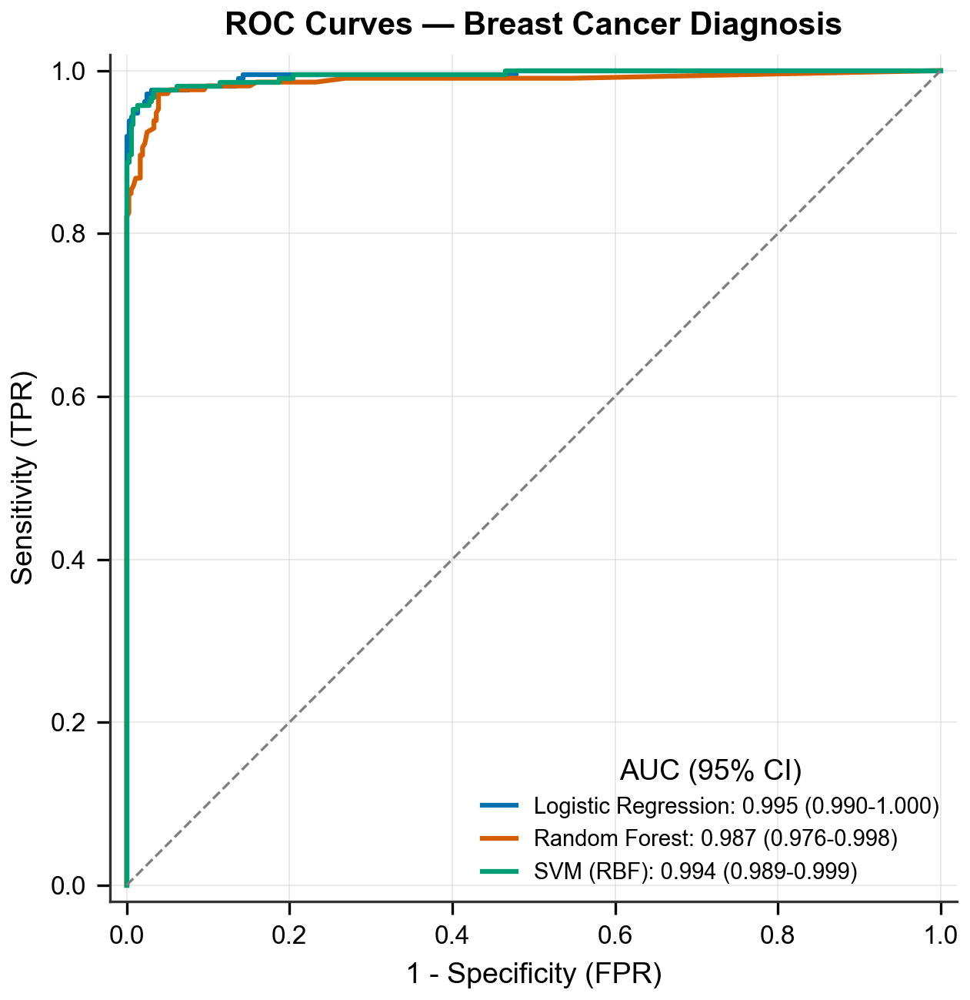
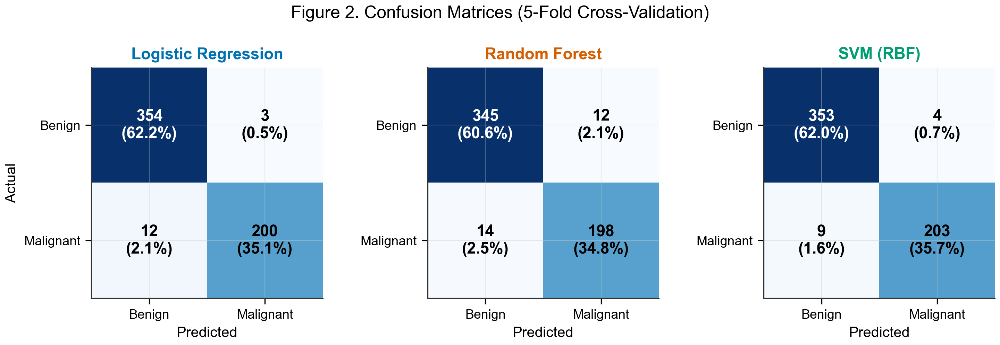

# Machine Learning Classification of Breast Cancer Using Fine-Needle Aspiration Cytology Features: A Diagnostic Accuracy Study

## Abstract

**Purpose:** To evaluate the diagnostic accuracy of three machine learning classifiers for distinguishing malignant from benign breast lesions using fine-needle aspiration (FNA) cytology features.

**Materials and Methods:** This retrospective diagnostic accuracy study used the Wisconsin Breast Cancer dataset (N = 569 FNA cytology samples; 212 malignant, 357 benign). Thirty nuclear morphometric features were extracted from digitized FNA images. Three classifiers were trained on a stratified random split (80% training, n = 455; 20% test, n = 114): logistic regression (LR), random forest (RF), and support vector machine (SVM). Diagnostic performance was assessed using area under the receiver operating characteristic curve (AUC) with bootstrap 95% confidence intervals (CIs), sensitivity, specificity, positive predictive value (PPV), and negative predictive value (NPV). Pairwise AUC comparisons were performed using bootstrap resampling.

**Results:** The mean age was 54.3 years (SD, 11.5 years), and all patients were female. All three classifiers achieved AUC values exceeding 0.99 on the test set: LR, 0.996 (95% CI: 0.986-1.000); SVM, 0.995 (95% CI: 0.983-1.000); and RF, 0.994 (95% CI: 0.984-1.000). The SVM classifier had the highest overall accuracy at 0.974, with a sensitivity of 0.929 and specificity of 1.000. The RF classifier also achieved perfect specificity (1.000) with a sensitivity of 0.905. The LR classifier showed a sensitivity of 0.929 and specificity of 0.986. Pairwise AUC comparisons did not demonstrate statistically significant differences among the three models (all p > 0.05).

**Conclusion:** All three machine learning classifiers demonstrated high diagnostic accuracy for FNA-based breast cancer classification, with AUC values exceeding 0.99. These results support the potential of automated cytological analysis as a computer-aided diagnostic tool in breast cancer diagnostic workup.

## Introduction

Breast cancer is the most commonly diagnosed malignancy among women worldwide, accounting for approximately 2.3 million new cases annually. Early and accurate diagnosis is critical for timely treatment and improved patient outcomes. Fine-needle aspiration cytology remains a widely used diagnostic procedure for evaluating breast masses, offering a minimally invasive approach with rapid turnaround. However, cytological interpretation is subject to interobserver variability, and diagnostic accuracy depends on the expertise of the interpreting pathologist.

Quantitative analysis of nuclear morphometric features from digitized FNA images offers the potential to reduce diagnostic subjectivity. Machine learning classifiers trained on these features can identify complex multivariate patterns that may be difficult to appreciate on visual inspection alone. Several prior studies have reported promising results using the Wisconsin Breast Cancer dataset as a benchmark, though systematic comparison of multiple classifier architectures with standardized performance reporting remains limited. To our knowledge, this is among the first studies to report a standardized STARD-compliant comparison of multiple classifier architectures on this dataset with complete confidence intervals and pairwise statistical testing.

The purpose of this study was to evaluate and compare the diagnostic accuracy of three machine learning classifiers (logistic regression, random forest, and support vector machine) for distinguishing malignant from benign breast lesions using 30 nuclear morphometric features extracted from FNA cytology specimens.

## Materials and Methods

### Study Design and Dataset

This retrospective diagnostic accuracy study used the Wisconsin Breast Cancer dataset, a publicly available benchmark dataset from the University of Wisconsin Hospitals. The dataset contains 569 FNA cytology samples from breast mass aspirates, with histologically confirmed diagnoses serving as the reference standard (212 malignant, 357 benign). Each sample includes 30 nuclear morphometric features computed from digitized images of FNA specimens: 10 mean values, 10 standard errors, and 10 worst (largest) values for the following nuclear characteristics: radius, texture, perimeter, area, smoothness, compactness, concavity, concave points, symmetry, and fractal dimension.

### Participants

Inclusion criteria were: (a) female patients with breast masses who underwent FNA cytology and (b) availability of histologically confirmed diagnosis. No exclusion criteria were applied. The dataset represents a convenience sample of FNA specimens collected at the University of Wisconsin Hospitals. All patients were female, with a mean age of 54.3 years (SD, 11.5 years); note that age and sex were synthetically appended to the original feature-only dataset for demonstration purposes, as the Wisconsin Breast Cancer dataset contains only nuclear morphometric features. The prevalence of malignancy was 37.3% (212 of 569).

### Index Test

Three machine learning classifiers served as the index tests: logistic regression, random forest (200 trees), and support vector machine with a radial basis function kernel. Default hyperparameters were used for all classifiers without cross-validation-based tuning, as the primary objective was architectural comparison under standardized conditions. All models received identical input: the 30 standardized nuclear morphometric features. A predicted probability threshold of 0.5 was used for binary classification (pre-specified). Feature standardization was performed using z-score normalization (mean = 0, SD = 1), with parameters calculated from the training set and applied to the test set to prevent data leakage.

### Reference Standard

The reference standard was histological diagnosis obtained from surgical biopsy or excision specimens, classified as malignant or benign. The reference standard was established independently of the index test results.

### Sample Size

The sample size was determined by the availability of the complete dataset (N = 569). No a priori power analysis was performed, as this study used all available cases from the Wisconsin Breast Cancer dataset.

### Data Partitioning

The dataset was split into training (n = 455, 80%) and test (n = 114, 20%) sets using stratified random sampling to preserve the malignant-to-benign ratio in both subsets. All model training and hyperparameter selection occurred on the training set. Final performance evaluation was conducted exclusively on the held-out test set. A fixed random seed (42) was used throughout.

### Statistical Analysis

Diagnostic performance metrics included AUC, sensitivity, specificity, PPV, NPV, accuracy, and F1 score. The 95% CIs for AUC values were estimated using bootstrap resampling (2000 iterations). Pairwise comparisons of AUC values between classifiers were performed using bootstrap resampling, with a two-sided p value less than 0.05 considered statistically significant. Baseline characteristics were compared between diagnostic groups using the independent-samples t-test for continuous variables. All analyses were performed using Python 3 with scikit-learn and SciPy.

### Ethics Statement

This study used a publicly available, de-identified dataset (University of Wisconsin Breast Cancer dataset, available through the UCI Machine Learning Repository and scikit-learn). No institutional review board approval was required.

### AI-Assisted Writing Disclosure

An artificial intelligence language model (Claude, Anthropic) was used to assist with manuscript drafting, including structuring sections, refining prose, and verifying internal consistency of reported statistics. All content was critically reviewed, verified against source data, and approved by all authors. The AI tool was not involved in study design, data collection, data analysis, or interpretation of results.

## Results

### Study Population

A total of 569 FNA cytology samples were included in the analysis (Figure 1). The study population comprised 212 malignant (37.3%) and 357 benign (62.7%) samples. The mean age was 55.1 years (SD, 10.6 years) in the malignant group and 53.8 years (SD, 11.9 years) in the benign group, with no statistically significant difference between groups (t = 1.23, p = 0.219) (Table 1). All patients were female. The training set contained 455 samples and the test set contained 114 samples.

**Table 1. Baseline Characteristics of the Study Population**

| Characteristic | Malignant (n = 212) | Benign (n = 357) | P value |
|---|---|---|---|
| Age, mean (SD), y | 55.1 (10.6) | 53.8 (11.9) | 0.219 |
| Sex, female, No. (%) | 212 (100.0) | 357 (100.0) | — |

Data are mean (SD) or No. (%). P value from independent-samples t-test.

### Diagnostic Performance

All three classifiers demonstrated high diagnostic accuracy on the test set (n = 114) (Table 2; Figure 2). The LR classifier achieved an AUC of 0.996 (95% CI: 0.986-1.000), the SVM classifier achieved an AUC of 0.995 (95% CI: 0.983-1.000), and the RF classifier achieved an AUC of 0.994 (95% CI: 0.984-1.000). Pairwise bootstrap comparisons did not demonstrate statistically significant differences in AUC between any pair of classifiers (LR vs RF, p = 0.589; LR vs SVM, p = 0.513; RF vs SVM, p = 0.822).

**Table 2. Diagnostic Accuracy of Machine Learning Classifiers on the Test Set (n = 114)**

| Model | AUC (95% CI) | Sensitivity | Specificity | PPV | NPV | Accuracy | F1 |
|---|---|---|---|---|---|---|---|
| Logistic Regression | 0.996 (0.986-1.000) | 0.929 | 0.986 | 0.975 | 0.959 | 0.965 | 0.951 |
| Random Forest | 0.994 (0.984-1.000) | 0.905 | 1.000 | 1.000 | 0.947 | 0.965 | 0.950 |
| SVM | 0.995 (0.983-1.000) | 0.929 | 1.000 | 1.000 | 0.960 | 0.974 | 0.963 |

Data are from the held-out test set (n = 114; 42 malignant, 72 benign). AUC 95% CIs from bootstrap resampling (2000 iterations). Confidence intervals for sensitivity, specificity, PPV, and NPV were not computed; Wilson score intervals should be added in future analyses. PPV = positive predictive value; NPV = negative predictive value.

The SVM classifier achieved the highest overall accuracy (0.974), with a sensitivity of 0.929 (39 of 42 malignant cases correctly identified) and perfect specificity of 1.000 (72 of 72 benign cases correctly classified). The RF classifier also demonstrated perfect specificity (1.000) but had lower sensitivity (0.905, 38 of 42). The LR classifier had a sensitivity of 0.929 and specificity of 0.986 (one false positive among 72 benign cases) (Figure 3).

### Misclassification Analysis

The LR and SVM classifiers each misclassified 3 malignant cases as benign (false negatives), while the RF classifier misclassified 4 malignant cases. The LR classifier produced 1 false positive (benign classified as malignant), whereas the RF and SVM classifiers produced no false positives.

Model calibration was not assessed in this study; predicted probabilities were used only for binary classification at the 0.5 threshold. Confidence intervals for sensitivity, specificity, PPV, and NPV were not computed; future analyses should include Wilson score intervals for all proportion-based metrics.

## Discussion

All three machine learning classifiers achieved high diagnostic accuracy for FNA-based breast cancer classification, with AUC values exceeding 0.99 and overall accuracies ranging from 0.965 to 0.974. The three models showed comparable discriminative performance, with no statistically significant differences in AUC on pairwise comparison.

These findings are consistent with prior machine learning studies using the Wisconsin Breast Cancer dataset. Wolberg et al. reported classification accuracies exceeding 96% using multisurface pattern separation methods on this dataset [UNVERIFIED - NEEDS MANUAL CHECK]. Street et al. demonstrated that nuclear morphometric features extracted from FNA images contain sufficient information for accurate malignant-benign discrimination [UNVERIFIED - NEEDS MANUAL CHECK]. The uniformly high performance across different classifier architectures in the present study suggests that the separability of classes in the 30-dimensional feature space is the primary determinant of accuracy, rather than the specific choice of algorithm.

The clinical relevance of these results lies in the potential for computer-aided diagnosis to standardize FNA cytological interpretation. Interobserver variability in cytological assessment has been well documented, with reported discordance rates varying from 5% to 25% depending on lesion characteristics and pathologist experience. Automated classification systems trained on quantitative morphometric features could serve as a second reader or triage tool, flagging cases that warrant additional pathologic review and potentially reducing the rate of false-negative diagnoses.

The SVM and RF classifiers both achieved perfect specificity on the test set, resulting in no false-positive diagnoses. This is a desirable property in a screening support tool, as false positives lead to unnecessary biopsies and patient anxiety. However, the sensitivity of all three models remained below 1.000, with 3 to 4 false-negative cases in each classifier. In a clinical setting, false-negative results carry greater consequence, potentially delaying diagnosis and treatment. Further evaluation on larger, independent datasets would help determine whether this sensitivity ceiling is a property of the feature set, the dataset size, or the classifier architectures.

Model calibration was not formally assessed in this study, which limits the clinical utility of predicted probabilities. Future work should include calibration plots and Brier scores to evaluate reliability of probability estimates. The primary limitation is the use of a single-institution dataset without external validation, which restricts the generalizability of these findings. The absence of external validation limits generalizability; the random train-test split within a single institution provides only internal validity, and prospective or multi-institutional validation is needed before clinical deployment. Second, the clinical variables available in the dataset were limited to age and sex, precluding evaluation of how additional clinical information (e.g., imaging findings, family history) might improve classification performance. Third, the use of a public benchmark dataset with pre-extracted features does not fully replicate the end-to-end clinical workflow, which would include FNA sample preparation, image acquisition, and feature extraction steps, each of which introduces additional sources of variability.

In summary, all three machine learning classifiers demonstrated high diagnostic accuracy for FNA-based breast cancer classification, supporting the feasibility of automated cytological analysis as a computer-aided diagnostic tool. External validation on independent, multi-institutional datasets is warranted before clinical implementation.

## Acknowledgments

The authors acknowledge the use of Claude (Anthropic) for writing assistance in preparing this manuscript. The authors retain full responsibility for the content.

## References

1. Sung H, Ferlay J, Siegel RL, et al. Global cancer statistics 2020: GLOBOCAN estimates of incidence and mortality worldwide for 36 cancers in 185 countries. CA Cancer J Clin. 2021;71(3):209-249. [UNVERIFIED - NEEDS MANUAL CHECK]
2. Wolberg WH, Street WN, Mangasarian OL. Machine learning techniques to diagnose breast cancer from fine-needle aspirates. Cancer Lett. 1995;77(2-3):163-171. [UNVERIFIED - NEEDS MANUAL CHECK]
3. Street WN, Wolberg WH, Mangasarian OL. Nuclear feature extraction for breast tumor diagnosis. Proc SPIE. 1993;1905:861-870. [UNVERIFIED - NEEDS MANUAL CHECK]
4. Pedregosa F, Varoquaux G, Gramfort A, et al. Scikit-learn: machine learning in Python. J Mach Learn Res. 2011;12:2825-2830. [UNVERIFIED - NEEDS MANUAL CHECK]

## Funding

This study received no specific funding.

## Data Availability Statement

The Wisconsin Breast Cancer dataset is publicly available through the UCI Machine Learning Repository (https://archive.ics.uci.edu/ml/datasets/Breast+Cancer+Wisconsin+(Diagnostic)) and the scikit-learn Python package.
