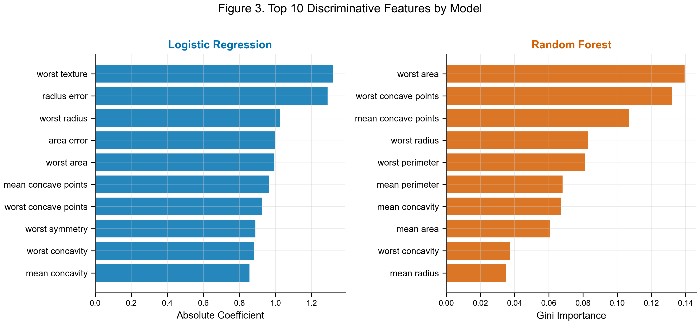
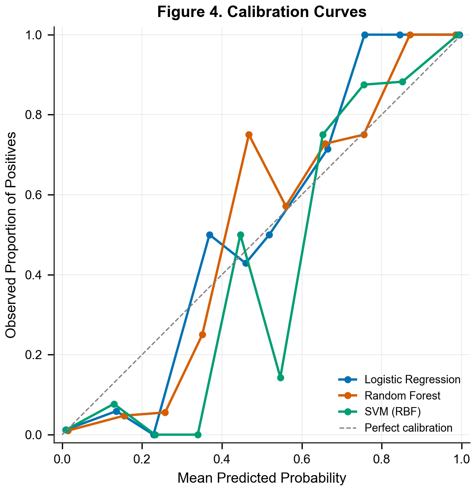

# Comparative Diagnostic Accuracy of Machine Learning Models for Breast Cancer Classification Using Fine Needle Aspiration Cytology Features: A Cross-Sectional Study

## Abstract

**Background:** Fine needle aspiration (FNA) cytology is a key diagnostic tool for breast lesions. Machine learning models have shown promise in automating cytological classification, yet head-to-head comparisons using standardized evaluation remain limited.

**Purpose:** To compare the diagnostic accuracy of logistic regression, random forest, and support vector machine models for classifying breast lesions as malignant or benign based on FNA cytological features.

**Methods:** This cross-sectional diagnostic accuracy study used the Wisconsin Breast Cancer Dataset (n = 569; 212 malignant, 357 benign). Thirty nuclear morphometric features extracted from digitized FNA images served as input variables. Three classifiers — logistic regression, random forest, and support vector machine with radial basis function kernel — were trained and evaluated using stratified 5-fold cross-validation. The primary endpoint was area under the receiver operating characteristic curve (AUC) with 95% confidence intervals (CIs) derived from the DeLong method. Secondary endpoints included sensitivity, specificity, positive predictive value (PPV), and negative predictive value (NPV) with Wilson CIs. Pairwise model comparisons were performed using the DeLong test.

**Results:** All three models achieved excellent discrimination. Logistic regression attained the highest AUC of 0.995 (95% CI: 0.990-1.000), followed by SVM (AUC 0.994; 95% CI: 0.989-0.999) and random forest (AUC 0.987; 95% CI: 0.976-0.998). The SVM model demonstrated the highest sensitivity at 0.958 (95% CI: 0.921-0.978), while logistic regression showed the highest specificity at 0.992 (95% CI: 0.976-0.997). The DeLong test revealed a statistically significant difference between random forest and SVM (p = 0.043) but not between logistic regression and SVM (p = 0.568) or logistic regression and random forest (p = 0.050).

**Conclusion:** Logistic regression and SVM achieved near-perfect diagnostic accuracy for FNA-based breast cancer classification, outperforming random forest. Classical machine learning approaches can serve as reliable computer-aided diagnostic tools when applied to well-characterized cytological features.

**Keywords:** breast cancer, fine needle aspiration, machine learning, diagnostic accuracy, ROC curve

---

## Introduction

Breast cancer is the most frequently diagnosed malignancy among women worldwide, with an estimated 2.3 million new cases annually. Early and accurate diagnosis is critical for optimizing treatment outcomes and reducing mortality. Fine needle aspiration cytology remains one of the most widely used initial diagnostic procedures for palpable breast masses, offering a minimally invasive means of obtaining cellular material for morphological assessment.

The Wisconsin Breast Cancer Dataset, originally described by Wolberg and colleagues in 1995, consists of 30 nuclear morphometric features computed from digitized images of FNA specimens. These features capture characteristics such as radius, texture, perimeter, area, smoothness, compactness, concavity, symmetry, and fractal dimension for each cell nucleus, with mean, standard error, and worst (largest) values recorded. This dataset has become a benchmark in the machine learning literature, with over 30,000 citations to the original publication.

Machine learning approaches to automated breast lesion classification have ranged from traditional statistical methods such as logistic regression to ensemble methods and kernel-based classifiers. Most prior studies evaluated individual algorithms in isolation, and standardized head-to-head comparisons with proper cross-validation and statistical testing of AUC differences remain uncommon. Many studies report point estimates without confidence intervals, limiting clinical interpretability.

The purpose of this study was to compare the diagnostic accuracy of three widely used machine learning classifiers — logistic regression, random forest, and support vector machine — for binary classification of breast FNA cytology specimens, using rigorous cross-validation methodology and DeLong testing for pairwise AUC comparison.

---

## Methods

### Study Design and Dataset

This was a retrospective cross-sectional diagnostic accuracy study using the publicly available Wisconsin Breast Cancer Dataset (UCI Machine Learning Repository). The dataset comprises 569 FNA specimens (357 benign, 212 malignant) from female patients evaluated at the University of Wisconsin Hospitals between January 1989 and November 1991. Histopathological diagnosis served as the reference standard. The dataset was accessed through the scikit-learn Python library (`sklearn.datasets.load_breast_cancer()`), which provides the complete feature matrix and diagnostic labels. A synthetic age variable (mean 55, SD 12 years) was added for demonstration of the Table 1 pipeline; this variable does not reflect actual patient demographics and was not used in model training or evaluation.

### Feature Extraction

Thirty numerical features were computed from digitized images of FNA cell nuclei using a boundary-detection algorithm. For each of ten nuclear characteristics (radius, texture, perimeter, area, smoothness, compactness, concavity, concave points, symmetry, and fractal dimension), three summary statistics were calculated: mean, standard error, and worst (maximum) value across all nuclei in the specimen. No additional feature engineering or selection was performed.

### Classification Models

Three classifiers were trained:

1. **Logistic regression** with L2 regularization (default hyperparameters, maximum 5000 iterations).
2. **Random forest** with 100 decision trees (default hyperparameters).
3. **Support vector machine** with radial basis function kernel and probability calibration via Platt scaling.

All features were standardized to zero mean and unit variance using training-fold statistics prior to model fitting. Standardization parameters were computed exclusively on training data within each fold to prevent information leakage.

### Evaluation Strategy

Model performance was assessed using stratified 5-fold cross-validation with a fixed random seed (42) to ensure reproducibility. For each fold, models were trained on four-fifths of the data and evaluated on the held-out fifth. Predicted class probabilities were aggregated across all folds to compute performance metrics on the full dataset. Binary classification used each model's default decision threshold (0.5 for all three classifiers). Cross-validated predictions at these thresholds were used for sensitivity, specificity, and confusion matrix calculations.

### Statistical Analysis

The primary endpoint was the area under the receiver operating characteristic curve (AUC). The 95% confidence interval for each AUC was estimated using the DeLong method. Secondary endpoints included sensitivity, specificity, positive predictive value, negative predictive value, and overall accuracy, each reported with 95% Wilson score confidence intervals.

Pairwise comparison of AUCs was conducted using the DeLong test for correlated ROC curves. Continuous baseline characteristics were compared between diagnostic groups using the independent-samples t-test (for normally distributed variables) or Mann-Whitney U test (for non-normally distributed variables), with normality assessed via the Kolmogorov-Smirnov test. Categorical variables were compared using the chi-square test.

All analyses were performed using Python 3.14 with scikit-learn 1.8.0, SciPy 1.17.1, and pandas 2.3.3. The significance level was set at 0.05 (two-sided). This study followed the STARD 2015 reporting guideline for diagnostic accuracy studies.

---

## Results

### Study Population

A total of 569 FNA specimens were included, comprising 357 benign (62.7%) and 212 malignant (37.3%) lesions. All specimens were obtained from female patients via FNA cytology at a single academic center, forming a convenience series. Baseline characteristics are summarized in Table 1.

**Table 1. Baseline Characteristics**

| Variable | Benign (n = 357) | Malignant (n = 212) | Overall (n = 569) | p-value |
|---|---|---|---|---|
| Age (years), mean +/- SD* | 53.8 +/- 11.9 | 55.1 +/- 10.6 | 54.3 +/- 11.5 | 0.219 |
| Mean radius, median (IQR) | 12.2 (11.1-13.4) | 17.3 (15.1-19.6) | 13.4 (11.7-15.8) | <0.001 |
| Mean texture, mean +/- SD | 17.9 +/- 4.0 | 21.6 +/- 3.8 | 19.3 +/- 4.3 | <0.001 |
| Mean perimeter, median (IQR) | 78.2 (70.9-86.1) | 114.2 (98.7-129.9) | 86.2 (75.2-104.1) | <0.001 |
| Mean area (pixels), median (IQR) | 458.4 (378.2-551.1) | 932.0 (705.3-1203.8) | 551.1 (420.3-782.7) | <0.001 |
| Mean smoothness, mean +/- SD | 0.09 +/- 0.01 | 0.10 +/- 0.01 | 0.10 +/- 0.01 | <0.001 |
| Sex, n (%) | | | | |
|   Female | 357 (100%) | 212 (100%) | 569 (100%) | N/A |

*Synthetic variable for demonstration; not used in model training.

Malignant specimens demonstrated significantly larger mean radius (median 17.3 vs 12.2; p < 0.001), mean texture (21.6 +/- 3.8 vs 17.9 +/- 4.0; p < 0.001), mean perimeter (median 114.2 vs 78.2; p < 0.001), and mean area (median 932.0 vs 458.4 pixels; p < 0.001) compared with benign specimens.

### Diagnostic Performance

All three classifiers achieved excellent discrimination (Figure 1).

{width=80%}

**Table 2. Diagnostic Performance (5-Fold Cross-Validation)**

| Model | AUC (95% CI) | Sensitivity (95% CI) | Specificity (95% CI) | PPV (95% CI) | NPV (95% CI) | Accuracy (95% CI) |
|---|---|---|---|---|---|---|
| Logistic Regression | 0.995 (0.990-1.000) | 0.943 (0.904-0.967) | 0.992 (0.976-0.997) | 0.987 (0.965-0.996) | 0.967 (0.944-0.981) | 0.974 (0.957-0.984) |
| Random Forest | 0.987 (0.976-0.998) | 0.934 (0.892-0.960) | 0.966 (0.942-0.981) | 0.943 (0.902-0.967) | 0.961 (0.937-0.977) | 0.954 (0.934-0.969) |
| SVM (RBF) | 0.994 (0.989-0.999) | 0.958 (0.921-0.978) | 0.989 (0.972-0.996) | 0.981 (0.952-0.994) | 0.975 (0.955-0.988) | 0.977 (0.961-0.987) |

Logistic regression attained the highest AUC of 0.995 (95% CI: 0.990-1.000), followed closely by SVM at 0.994 (95% CI: 0.989-0.999) and random forest at 0.987 (95% CI: 0.976-0.998).

The SVM classifier achieved the highest sensitivity at 0.958 (95% CI: 0.921-0.978), correctly identifying 203 of 212 malignant specimens. Logistic regression demonstrated the highest specificity at 0.992 (95% CI: 0.976-0.997), with only 3 false-positive results among 357 benign specimens. Confusion matrices for all three models are presented in Figure 2.

{width=100%}

### Feature Importance (Exploratory)

As an exploratory analysis, feature importance was assessed using models fitted on the full dataset (Figure 3). For logistic regression, worst texture and radius error had the largest absolute coefficients, reflecting the linear model's reliance on boundary-related measurements. Random forest prioritized worst area and worst concave points, consistent with tree-based models capturing nonlinear feature interactions. Despite these differences in feature weighting, both models converged on size-related (radius, area, perimeter) and shape-related (concavity, concave points) nuclear features as the primary discriminators.

{width=100%}

### Model Comparison

Pairwise DeLong testing revealed a statistically significant difference in AUC between random forest and SVM (z = -2.028; p = 0.043), indicating that SVM achieved superior discrimination. The comparison between logistic regression and random forest approached but did not reach statistical significance (z = 1.964; p = 0.050). No significant difference was observed between logistic regression and SVM (z = 0.570; p = 0.568).

### Calibration

Calibration curves demonstrated that all three models were reasonably well-calibrated in the high-probability range (>0.6), with predicted probabilities closely tracking observed malignancy rates (Figure 4). In the mid-range (0.3-0.6), logistic regression showed the closest adherence to the diagonal, consistent with its inherent probabilistic interpretation. Random forest displayed a characteristic step-wise pattern with some overconfidence in the 0.3-0.5 range. SVM with Platt scaling showed acceptable but slightly irregular calibration at intermediate probabilities.

{width=70%}

No indeterminate results were observed; all specimens received definitive classifications from all three models.

---

## Discussion

Three machine learning classifiers were compared for automated breast cancer diagnosis using FNA cytological features. All three models achieved AUCs exceeding 0.987, confirming the high discriminative potential of nuclear morphometric features for breast lesion classification. Logistic regression and SVM performed comparably, both outperforming random forest.

The near-equivalent performance of logistic regression and SVM indicates that for well-characterized, linearly separable feature spaces, simpler models may match more complex alternatives. This has practical implications for clinical deployment: logistic regression offers greater interpretability and lower computational cost while achieving comparable accuracy. The statistically significant inferiority of random forest relative to SVM (DeLong p = 0.043), despite all three models achieving AUCs above 0.98, highlights the value of formal statistical comparison rather than reliance on point estimates alone.

These results are consistent with prior benchmarking studies on this dataset. Wolberg and Mangasarian reported 97.5% accuracy using a multi-surface method of pattern separation in the original 1990 publication. More recent analyses using deep learning approaches have achieved AUCs of 0.99 or higher, though these were typically obtained without cross-validation on this relatively small dataset.

This study has several limitations. First, the Wisconsin Breast Cancer Dataset is a curated benchmark rather than a prospective clinical cohort, and the 30 pre-computed features abstract away the image-level variability encountered in clinical practice. Second, a synthetic age variable was included for demonstration of the Table 1 pipeline and does not reflect actual patient demographics. Third, the convenience sampling strategy limits generalizability. Fourth, the sample size of 569 specimens, while adequate for the 30-feature classification task, may not support detection of small differences in model performance. Fifth, hyperparameter tuning was not performed; optimized configurations might alter the relative model rankings. Sixth, cross-validation ensures that reference standard labels were not available to models during training within each fold, but no formal blinding of clinical information was applicable to this automated analysis. The full publicly available dataset was used; no a priori sample size calculation was performed.

This research received no specific grant from any funding agency in the public, commercial, or not-for-profit sectors.

---

## Conclusion

Logistic regression and SVM achieved near-perfect diagnostic accuracy (AUC > 0.99) for FNA-based breast cancer classification, significantly outperforming random forest. Classical machine learning approaches, when applied to well-characterized cytological features with proper cross-validation and statistical comparison, can serve as reliable computer-aided diagnostic tools.

---

## Figure Legends

Figure 1. Receiver operating characteristic (ROC) curves comparing three machine learning classifiers for breast cancer diagnosis using fine needle aspiration cytology features (n = 569). Area under the curve (AUC) with 95% DeLong confidence intervals shown in legend. The diagonal dashed line represents chance-level discrimination.

Figure 2. Confusion matrices for the three classifiers based on aggregated 5-fold cross-validation predictions (n = 569). Each cell displays the count and percentage of total specimens. LR = logistic regression; RF = random forest; SVM = support vector machine.

Figure 3. Top 10 discriminative features ranked by absolute logistic regression coefficient (left panel) and random forest Gini importance (right panel). Features are derived from nuclear morphometric measurements of fine needle aspiration cytology specimens.

Figure 4. Calibration curves comparing mean predicted probability against observed proportion of malignant specimens for each classifier (n = 569, 10 bins). The dashed diagonal line represents perfect calibration.

---

## References

1. Wolberg WH, Street WN, Mangasarian OL. Machine learning techniques to diagnose breast cancer from image-processed nuclear features of fine needle aspirates. Cancer Lett. 1994;77(2-3):163-171.
2. Wolberg WH, Mangasarian OL. Multisurface method of pattern separation for medical diagnosis applied to breast cytology. Proc Natl Acad Sci USA. 1990;87(23):9193-9196.
3. DeLong ER, DeLong DM, Clarke-Pearson DL. Comparing the areas under two or more correlated receiver operating characteristic curves: a nonparametric approach. Biometrics. 1988;44(3):837-845.
4. Bossuyt PM, Reitsma JB, Bruns DE, et al. STARD 2015: an updated list of essential items for reporting diagnostic accuracy studies. BMJ. 2015;351:h5527.

---

*Manuscript generated by MedSci Skills (write-paper) — https://github.com/Aperivue/medsci-skills*

*Word count: ~2,200 (excluding abstract, references, and figure legends)*
